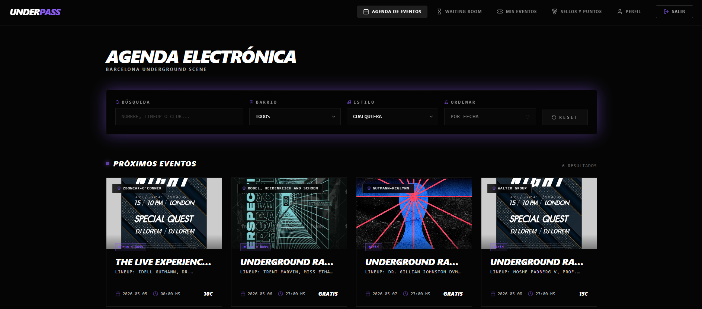
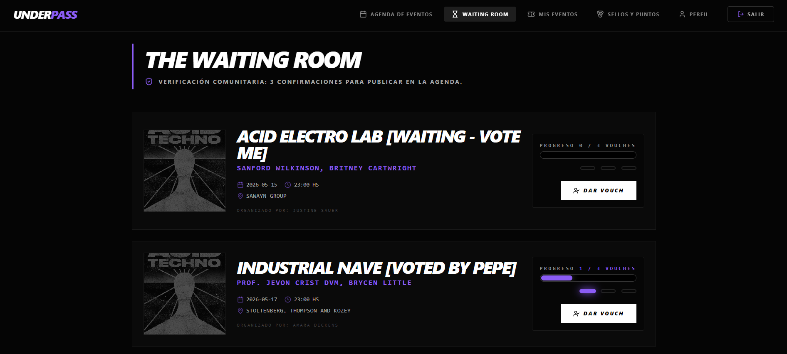
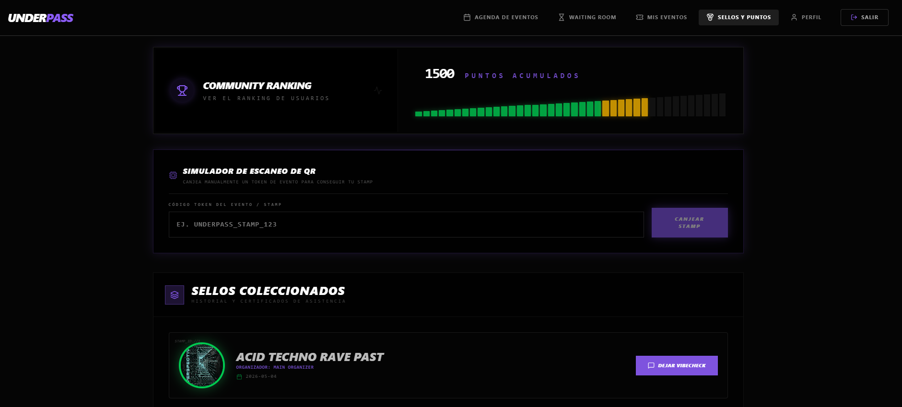
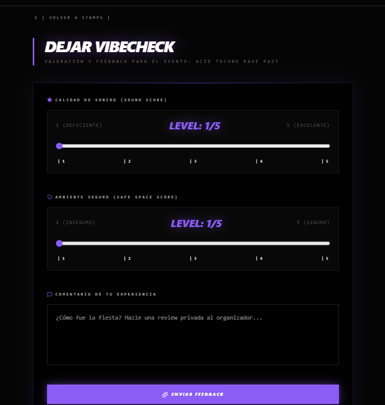

<p align="center">
  <!-- Add banner image here -->
  
</p>

<p align="center">
  Check the <a href="https://underpass.up.railway.app/"><strong>live demo here</strong></a> and the API documentation <a href="https://underpass-api-production.up.railway.app/docs"><strong>here</strong></a> 
</p>

## 📚 Table of Contents

- [About](#about)
- [Tech Stack](#-tech-stack)
- [Features](#features)
- [Setup & Installation](#️-setup--installation)
- [Environment Variables](#-environment-variables)
- [Architecture](#architecture)
- [Deployment](#deployment)
- [Demo Accounts](#-demo-accounts)
- [Upcoming Improvements](#-upcoming-improvements)
- [Credits](#-credits)

## About

**UnderPass** is a decentralized electronic music agenda for the Barcelona underground scene. Unlike traditional platforms, it relies on the community to verify events and uses a gamification loop (Stamps & Points) to ensure that only physical attendees can provide qualitative feedback ("Vibechecks").

This repository contains the React frontend that consumes the [UnderPass API](https://github.com/francobrida/UnderPass-API) engine. Built with React 19 and Vite, it provides a dynamic interface with role-based routing (Clubber, Organizer, Admin) and seamless QR code management for the gamification flow.

## 💻 Tech Stack

- **Framework:** React 19
- **Build tool:** Vite
- **Styling:** Tailwind CSS v4
- **Routing:** React Router v7
- **HTTP client:** Axios
- **QR Generation:** qrcode.react

## Features

<p align="center">
  <!-- Add features overview image here -->
  
</p>

### Authentication

- Login, Register and Logout connected to the API via Bearer token (Laravel Passport).

### Vouch-to-Verify System

- **Waiting Room:** View unverified events pending approval.
- **Vouching:** Logued users can "vouch" for an event. Reach 3 vouches to auto-verify!

### Role-Based Access Control

- **Clubber:** Vouch for events, collect stamps, and submit Vibechecks.
- **Organizer:** Manage QR codes for verified events and host multiple events.
- **Admin:** Full moderation and system control.

### Gamification & Vibechecks

- **Digital Passport & Stamps:** Scan a unique QR code at a verified event to receive a collectible Stamp.
- **Vibechecks:** Only attendees with a stamp can rate the event's Sound and Safety.
- **Leaderboard:** Community ranking based on points.

<p align="center">
  
</p>
<p align="center">
  
</p>
<p align="center">
  
</p>
<p align="center">
  
</p>

<p align="center">
  
</p>

## 🛠️ Setup & Installation

### Prerequisites

- Node.js >= 18
- **UnderPass API running locally** — follow the [API setup instructions](https://github.com/francobrida/UnderPass-API) before starting the frontend.

### Clone the repository

```bash
git clone https://github.com/francobrida/Underpass-web.git
cd Underpass-web
```

### Install dependencies

```bash
npm install
```

### Configure environment

Create a `.env` file in the root:

```bash
cp .env.example .env
```

### Start the development server

```bash
npm run dev
```

The app will be available at `http://localhost:5173`

## 🔑 Environment Variables

| Variable       | Description                  | Default                        |
| -------------- | ---------------------------- | ------------------------------ |
| `VITE_API_URL` | Base URL of the UnderPass API| `http://localhost:8000/api/v1` |

> All variables exposed to the browser must be prefixed with `VITE_`. This is a Vite security convention.

## Architecture

Built with **React 19** and **Vite**. 

All API calls are centralized and managed via Axios, where tokens are attached automatically once the user authenticates. React Router v7 handles protected routes, ensuring only Admins, Organizers, or authenticated Clubbers access their specific views.

## 🚀 Deployment

The frontend is continuously deployed on **Railway**. 

Unlike the backend (which may require a specific Dockerfile for Java/Spring Boot configurations), this frontend utilizes Railway's automatic **Nixpacks** builder. When connected to the repository, Railway automatically detects the `package.json`, installs the Node.js environment, and runs the build script (`npm run build`).

To run it locally:

```bash
npm install
npm run dev
```

To test the production build locally:

```bash
npm run build
npm run preview
```

### Live Links

- **Frontend Demo** — [https://underpass.up.railway.app/](https://underpass.up.railway.app/)
- **API Docs** — [https://underpass-api-production.up.railway.app/docs](https://underpass-api-production.up.railway.app/docs)

## 🔐 Test Credentials

To evaluate the platform, use the following pre-seeded accounts (run `php artisan migrate --seed` on the API first):

**Admin**
- **Email:** `admin@underpass.com`
- **Password:** `password`
- **Access:** Full Dashboard, User Management, and Event CRUD.

**Event Organizer**
- **Email:** `organizer@test.com`
- **Password:** `password`
- **Access:** Create Events, View QR Codes, and check Event Feedback.

**Clubber (User)**
- **Email:** `clubber@test.com`
- **Password:** `password`
- **Access:** Vouch for events, Claim Stamps (Gamification), and submit Vibechecks.

## 🕹️ Quick Testing Guide

Follow this flow to test the UnderPass core logic, from basic CRUD to the Gamification loop:

**Step 1: Event Creation (Basic CRUD)**
- **Login as:** `clubber@test.com` (password: `password`).
- **Action:** Go to "Mis Eventos", then "Crear Evento". Fill in the details for a new underground party.
- **Logic:** The event is created with `is_verified = false`. It will not appear in the main feed yet; instead, it goes directly to the Waiting Room.

**Step 2: Vouching (Community Power)**
- **Login as:** `clubber@test.com`.
- **Action:** Go to the Waiting Room. Find the event you just created (or the one named "Test Event no verificado" from the Seeder).
- **Logic:** Events need 3 "vouches" to be published. Since you cannot vouch for your own event, the Seeder provides other pending events. Once a "Clubber" event reaches the 3-vouch limit, it is published, and the User Role is automatically promoted to "Organizer", allowing the user to have more than one active event.

**Step 3: The QR & Stamping (Scan Simulation)**
- **Login as:** `organizer@test.com`.
- **Action:** Go to "Mis Eventos" and enter the verified event "Main Stage Techno".
- **Logic:** As the owner of a verified event, the QR Code (Stamp Token) will be displayed.
- **Simulate Scan:** Click the "Descargar QR" button or copy the link. Accessing that URL while logged in as a Clubber will automatically generate a Stamp in the user's account.

**Step 4: Sellos y Puntos (The Passport)**
- **Login as:** `clubber@test.com`.
- **Action:** Enter the "Sellos y Puntos" section.
- **Logic:** Check your stamp collection (including "Flashback Night" from the Seeder) and your updated point counter. This is the visual proof of your clubbing history.

**Step 5: VibeCheck (Post-Event Feedback)**
- **Login as:** `clubber@test.com`.
- **Action:** Within "Sellos y Puntos", find the event "Noche de Vinilo & Techno".
- **Logic:** Because the event has ended and you have the Stamp, the "DEJAR VIBECHECK" button is active. Submit the rating to earn +5 extra points.

**Step 6: Admin Panel (Moderation)**
- **Login as:** `admin@underpass.com`.
- **Action:** Access the Admin Panel.
- **Logic:** Perform CRUD operations on users and events. Admins can manually verify events or delete inappropriate content to keep the platform safe.

## 🚧 Upcoming Improvements
Short term:
- Push Notifications for verified events.
- Points Marketplace to exchange points for benefits.
- Enhanced Organizer Dashboard with historical Vibechecks data.
- Filters for events in the Waiting Room and users/events in Admin Panel.
Long term:
- Ticket Sales for events (Organizers can set a price for their events and users can buy tickets).
- User's Ticket QR Code generation for event entry.

## 🎨 Credits

Developed by **Franco Bridarolli** - 2026.
